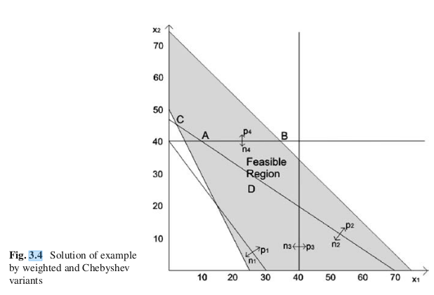

# goal programming 
multiple criteria wdecision-making (MCDM/A)

## apa itu 
Goal programming is a way to satisfy (sometimes conflicting) goals by ranking the goals by priority. The optimization algorithm will attempt to optimize each goal one at a time, starting with the goal with the highest priority and moving down through the list. Even if a goal cannot be satisfied, the goal programming algorithm will move on when it has found the best possible answer. Goals can be roughly divided into two types:

As long as we satisfy the goal, we do not care by how much. If we cannot satisfy a goal, any lower priority goals are not allowed to increase the amount by which we exceed (which is equivalent to not allowing any change at all to the exceedance).
We try to achieve as low a value as possible. Any lower priority goals are not allowed to result in an increase of this value (which is equivalent to not allowing any change at all).
In this example, we will be specifying two goals, on for each type. The higher priority goal will be to maintain the water level of the storage element between two levels. The lower priority goal will be to minimize the total volume pumped.

- solving the infeasible solution from LP model

>Charnes and Cooper (1961, p. 215) put it this way:
"Whether goals or attainable or not, an objective may then be stated in which
optimization gives a result which comes 'as close as possible' to the indicated
goals." 

## research paper menarik
[Rearch Paper Summary](https://github.com/atriple/ro2/tree/master/project_goal_optimization/research_paper)
> jauh2 dari fuzzy
- ~~https://www.sciencedirect.com/science/article/pii/S0305048306001241 -- goal programming on recycling system -- [accessed 3-Apr-19, 11.38]~~
- https://link.springer.com/article/10.1007/BF02032309 http://sci-hub.tw/https://link.springer.com/article/10.1007/BF02032309 -- membahas berbagai macam topik GP -- [accessed 3-apr-19, 12.20]

- https://pubsonline.informs.org/doi/abs/10.1287/mnsc.18.8.b395 -- gp untuk mengalokasi sumber daya pada universitas --- [accessed 3-Apr-19, 12.40], [summary](https://github.com/atriple/ro2/blob/master/project_goal_optimization/research_paper/academic-resource-allocation.md)


## implementasi goal programming 
- two version of GP (Chanes and Cooper, 1961)
  - weighted (punya prioritas)
    - min: $Z = \sum_{i \in m} P_i * \sum_{k=1}^{n_i}(w_{ik}^+ d_i^+ + w_{ik}^- d_i^-)$
    - subject to: $\sum_{j=1}^na_{i,j}x_j-d_i^+ + d_i^- = b_i$
    - dimana $P_i > P_{i+q} > P_{i+2}$ (prioritas soft criteria ke-i)
  - lexicographic (seperate priorities)
    - min: $Z = \sum_{i\in m} P_i (d_i^+ + d_i^-)$
    - s.t.: $\sum_{j=1}^n a_{ij} x_{j} - d_i^+ + d_i^- = b_i$
- biasa diguanakn di ms/or (management science / operation research)
  - multiple criteria decision making (mcdm)
  - solving managerial problems when multiple objectives are present   
  

  ### Practical Goal Programming (Dylan jones, Mehrdad Tamiz, 2010)
  - Jenis
    - Generic
    - Distance Based
      - **Lexicographic**
        - *priorities goals over others.*
        - has a number of priority levels
        - predefined set of goals 
        - no direct 'trade off' comparisons between goals. 
        - contoh?
      - **Weighted** 
        - chooses set of decision variable values which together *make the achievement function lowest*. 
          - makes other goals have a poor result
        - allow directr trade off between unwanted deviational variables by placing the in a weighted, normalized single achievement function 
          - achievement function: variables that penalizes objective function
        - contoh
      - Chebyshev (Minmax Goal Programming) 
        - uses $L_{\infty}$ distance metric
          - $L_{\infty}$ adalah sebuah norma, dimana norma biasanya disebut sebagai dimensi vektor [definisi lengkap](https://rorasa.wordpress.com/2012/05/13/l0-norm-l1-norm-l2-norm-l-infinity-norm/)
          - where p is the $L_p$ norm
          - $\|x\|_p = \sqrt[p]{\Sigma_i |x_i|^p}$
            - $L_1$ norm: 
              - SAD (sum of absolute distance)
              - MAE (mean absolute error)
            - $L_2$ norm: 
              - most popular norm 
              - SSD (Sum of squared distance)
              - MSE (Mean Squared Error )
              - Euclidean Distance
              - $\|x\|_2 = \sqrt{\Sigma_i x_i^2}$
            - $L_{\infty} norm$
              - maximum entrires magnitude of that vector. 
              - $\|x\|_{\infty} = \sqrt{\Sigma_i x_i^\infty}$
              - $\|x\|_{\infty} = max(|x_i|)$
        - achieves balance between achievement function and objective function 
        - can find optimal soultion for linear models, that don't have extreme point in decision space
        - 
    - Decision Based 
      - Fuzzy 
      - Integer and Binary 
      - Fractional 
  - Pareto efficiency 
    - objective: objective not improved without worsening the value of other objective (objective = goal)
### chebyshev goal programming result: 
```python 
x1 =  73.0
x2 =  117.0
The first goal is overachieved by  14.0
The second goal is overachieved by  16.0
The third goal is underachieved by  170.0
The fourth goal is fully satisfied
```
  
--------


## bikin ppt 

------
# references

## contoh soal cantik 
[multivariable optimization pake prioritas](http://prejudice.tripod.com/ME30B/two_gp.htm)
## contoh soal pake solver (Excel)
https://www.youtube.com/watch?v=Ytzr3LY6iS0
https://www.youtube.com/watch?v=iIdDPl2nkYo

## references
- [optimization with python](https://www2.hawaii.edu/~jonghyun/classes/S18/CEE696/schedule.html)
    - only needed [this](https://www2.hawaii.edu/~jonghyun/classes/S18/CEE696/files/04_scipy_optimize.pdf)
    - and [this](https://www2.hawaii.edu/~jonghyun/classes/S18/CEE696/files/08_scipy_optimize2.pdf)


