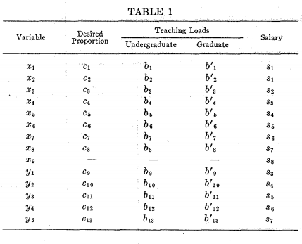

# GP for Academic Resource Allocation
Source : https://pubsonline.informs.org/doi/abs/10.1287/mnsc.18.8.b395 ([Scihub](http://sci-hub.tw/https://pubsonline.informs.org/doi/pdf/10.1287/mnsc.18.8.B395))

Accessed on : 3-Apr-19, 12.40

## Summary

Goal Programming Model and Approach for an optimum allocation of resources in an institution of higher learning.

### The General Model
#### Variables :
$x_1 =$ number of graduates research assistants,  
$x_2 =$ number of graduate teaching assistants,  
$x_3 =$ number of instructors,  
$x_4 =$ number of assistant professors, without terminal degree **(gelar paling tinggi, contohnya PhD, MBA, dll.)**  
$x_5 =$ number of associate professors, without terminal degree,  
$x_6 =$ number of full professors professors, without terminal degree,  
$x_7 =$ number of part-time faculty without terminal degree,  
$x_8 =$ number of special professors without terminal degree,  
$x_9 =$ number of staff,
$y=$ number of assistant professors, with terminal degree  
$y_2 number of associate professors, without terminal degree,  
$x_6 =$ number of full professors professors, without terminal degree,  
$x_7 =$ number of part-time faculty without terminal degree,  
$x_8 =$ number of special professors without terminal degree,  
**dan berlanjut, agak males sih ngetiknya, banyak banget, pdfnya image scan(gabisa dicopy). ini tabel dari papernya untuk sementara...**

#### Constraints :
formulanya akan ditulis nanti... ada 9 constraint in total
- Accreditation
  - certain percentage of academic staff must be full-time.
  - certain percentage of academic staff (either on undergraduate or graduate) required to possess terminal degree.
  - ada 1 constraint lagi, tapi di paper bilangnya "not necessary" (nanti akan dijabarkan lebih lanjut..)
- Total Number of Academic Staff
- Distribution of Academic Staff
- Number of Staff
- Number of Graduate Research Assistants
- Salary Increase -- perlu adanya peningkatan gaji secara berkala supaya kualitas staff terjaga.
- Total Payroll Budget 

#### Objective Function :
Minimize deviations. With priority factor based on univesity policies, conditions, etc.

